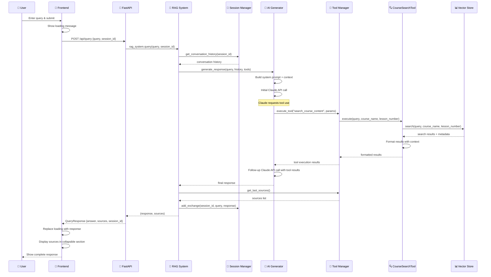
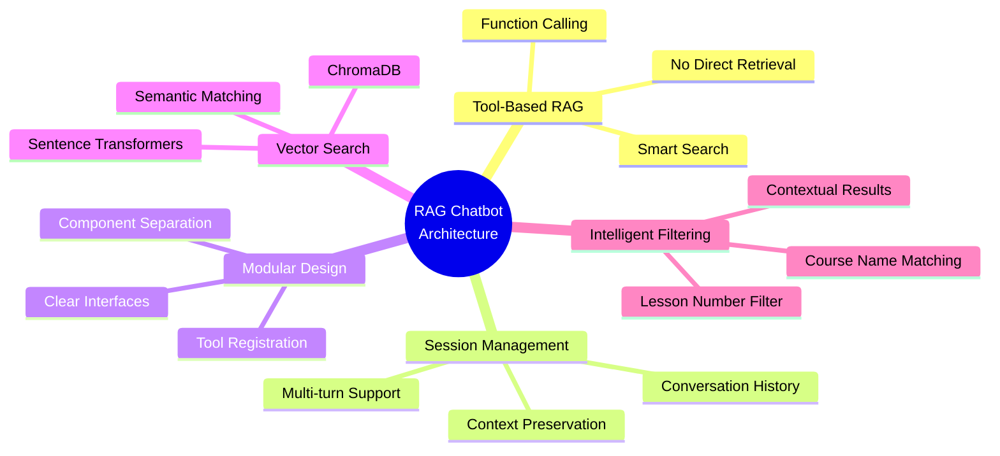

# RAG Chatbot Query Processing Flow

```mermaid
graph TD
    %% Frontend Layer
    A[👤 User Input<br/>script.js:45-96] --> B[📤 sendMessage()<br/>POST /api/query]

    %% API Layer
    B --> C[🚀 FastAPI Endpoint<br/>app.py:56-74<br/>• Receive QueryRequest<br/>• Create/get session<br/>• Call rag_system.query()]

    %% RAG System
    C --> D[🧠 RAG System<br/>rag_system.py:102-140<br/>• Build AI prompt<br/>• Get conversation history<br/>• Call ai_generator]

    %% Session Management
    D <--> E[💾 Session Manager<br/>session_manager.py<br/>• Create/manage sessions<br/>• Store conversation history<br/>• Provide context]

    %% AI Generation
    D --> F[🤖 AI Generator<br/>ai_generator.py:43-135<br/>• Build system prompt + context<br/>• Initial API call to Claude<br/>• Handle tool execution]

    %% Tool Management
    F --> G[🔧 Tool Manager<br/>search_tools.py:116-154<br/>• Register CourseSearchTool<br/>• Provide tool definitions<br/>• Execute tool calls]

    %% Course Search Tool
    G --> H[🔍 CourseSearchTool<br/>search_tools.py:20-114<br/>• Receive search parameters<br/>• Apply filters<br/>• Format results with context<br/>• Store sources for UI]

    %% Vector Store
    H --> I[📊 Vector Store<br/>vector_store.py<br/>• Semantic search with embeddings<br/>• Course title matching<br/>• Lesson number filtering<br/>• Return ranked results]

    %% Return Flow
    I --> H
    H --> G
    G --> F
    F --> D
    D --> C
    C --> B
    B --> J[📱 Display Response<br/>• Replace loading message<br/>• Show AI response<br/>• Display sources]

    %% Styling
    classDef frontend fill:#e3f2fd,stroke:#1976d2,stroke-width:2px
    classDef api fill:#fff3e0,stroke:#f57c00,stroke-width:2px
    classDef rag fill:#f3e5f5,stroke:#7b1fa2,stroke-width:2px
    classDef ai fill:#e8f5e8,stroke:#388e3c,stroke-width:2px
    classDef tools fill:#fff8e1,stroke:#ffa000,stroke-width:2px
    classDef search fill:#fce4ec,stroke:#c2185b,stroke-width:2px
    classDef data fill:#e1f5fe,stroke:#0277bd,stroke-width:2px
    classDef session fill:#f1f8e9,stroke:#689f38,stroke-width:2px

    class A,B,J frontend
    class C api
    class D rag
    class F ai
    class G tools
    class H search
    class I data
    class E session
```

## Detailed Flow Sequence



## Architecture Highlights



## Key Components

| Component | File | Responsibility |
|-----------|------|----------------|
| 🤖 **AI Generator** | `ai_generator.py` | Claude API integration, tool execution handling |
| 🔧 **Tool Manager** | `search_tools.py` | Tool registration, execution, source tracking |
| 🔍 **CourseSearchTool** | `search_tools.py` | Semantic search with filtering capabilities |
| 📊 **Vector Store** | `vector_store.py` | ChromaDB operations, embedding search |
| 💾 **Session Manager** | `session_manager.py` | Conversation history management |
| 🧠 **RAG System** | `rag_system.py` | Main orchestrator coordinating all components |
| 🚀 **FastAPI App** | `app.py` | Web server, API endpoints, static file serving |
| 📱 **Frontend** | `script.js` | User interface, HTTP communication |